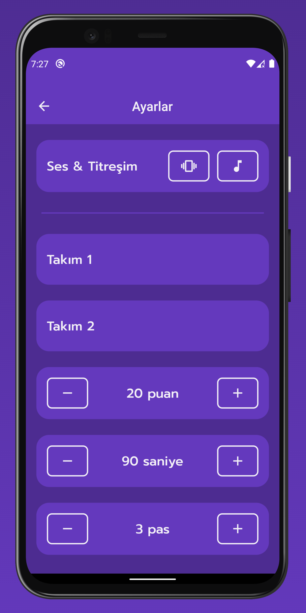

# taby

It's a taboo game.

## Tech and Libraries

- MVVM Architecture
- State Management: [Provider](https://pub.dev/packages/provider)
- Database: [Hive](https://pub.dev/packages/hive)
- Ads: [Google Mobile Ads](https://pub.dev/packages/google_mobile_ads)

## Play Store

## Screenshots

<table>
  <tr align="center">
    <td colspan="2">Home Screen</td>
</tr>
  <tr align="center">
    <td colspan="2"></td>
  </tr>
  <tr align="center">
    <td colspan="2">Game Screen</td>
  </tr>
  <tr align="center">
    <td></td>
    <td></td>
  </tr>
  <tr align="center">
    <td colspan="2">Game Pause Screen</td>
  </tr>
  <tr align="center">
    <td colspan="2"></td>
  </tr>
  <tr align="center">
    <td colspan="2">Game Time End Screen</td>
  </tr>
  <tr align="center">
    <td colspan="2"></td>
  </tr>
  <tr align="center">
    <td colspan="2">Game End Screen</td>
  </tr>
  <tr align="center">
    <td colspan="2"></td>
  </tr>
  <tr align="center">
    <td colspan="2">Settings Screen</td>
  </tr>
  <tr align="center">
    <td colspan="2"></td>
  </tr>
 </table>
